# Three.js Demos

Twelve carefully composed WebGL scenes with a true alpha renderer and static, reproducible export pose.

`catalog.json` records the scene use, question, family, complexity, and techniques.

| Orbital | Terrain | Crystal | Molecule |
|---|---|---|---|
| 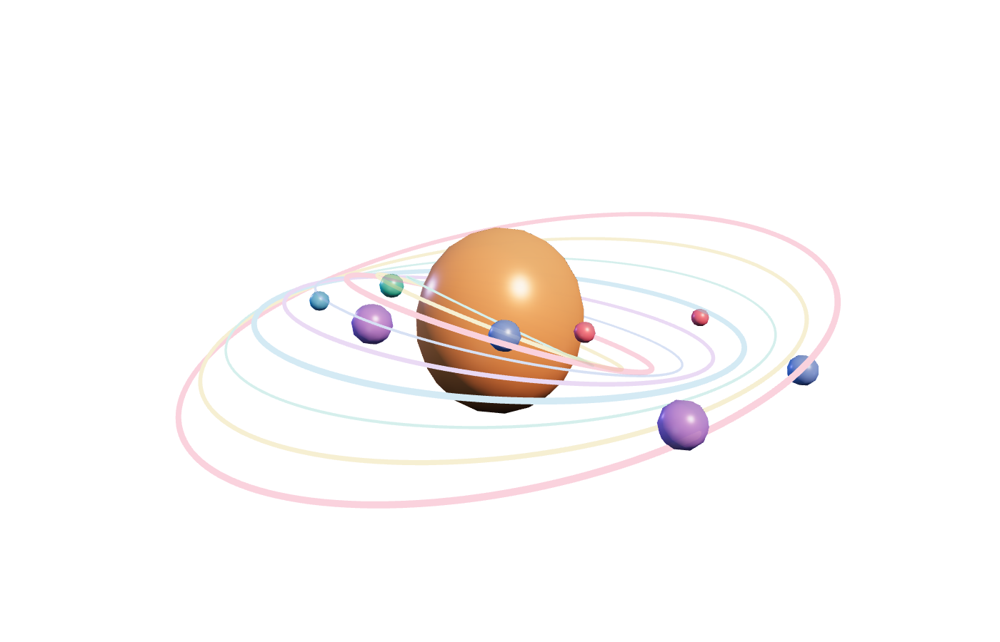 | 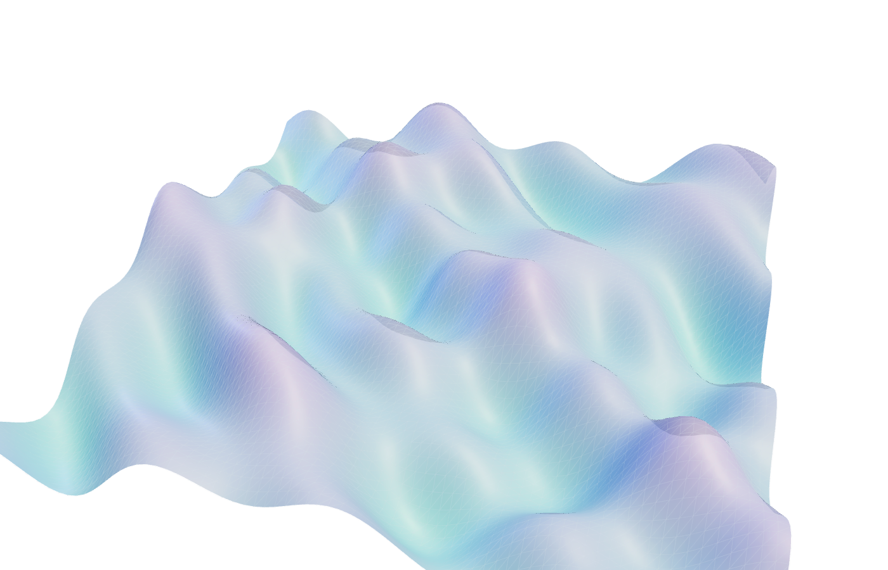 | 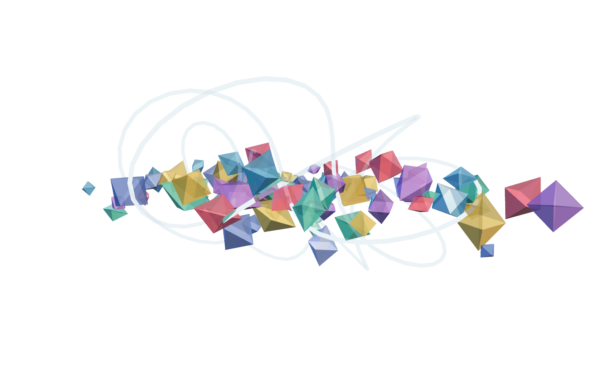 | 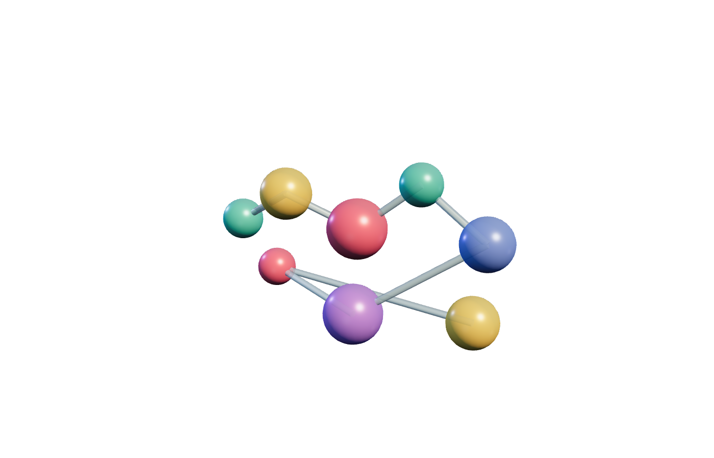 |
| City | Globe | Ribbons | Lattice |
| 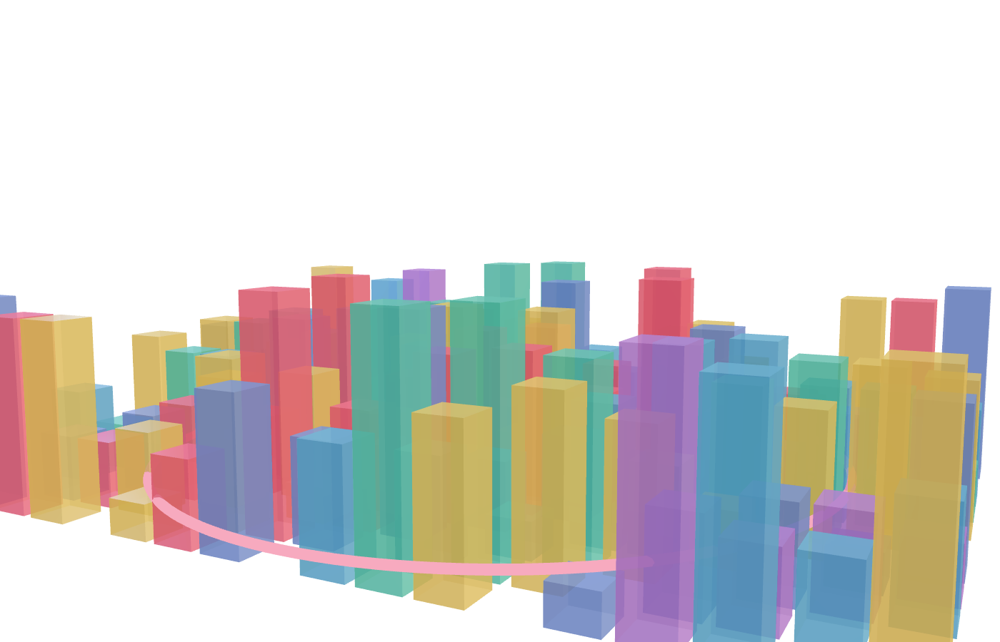 | 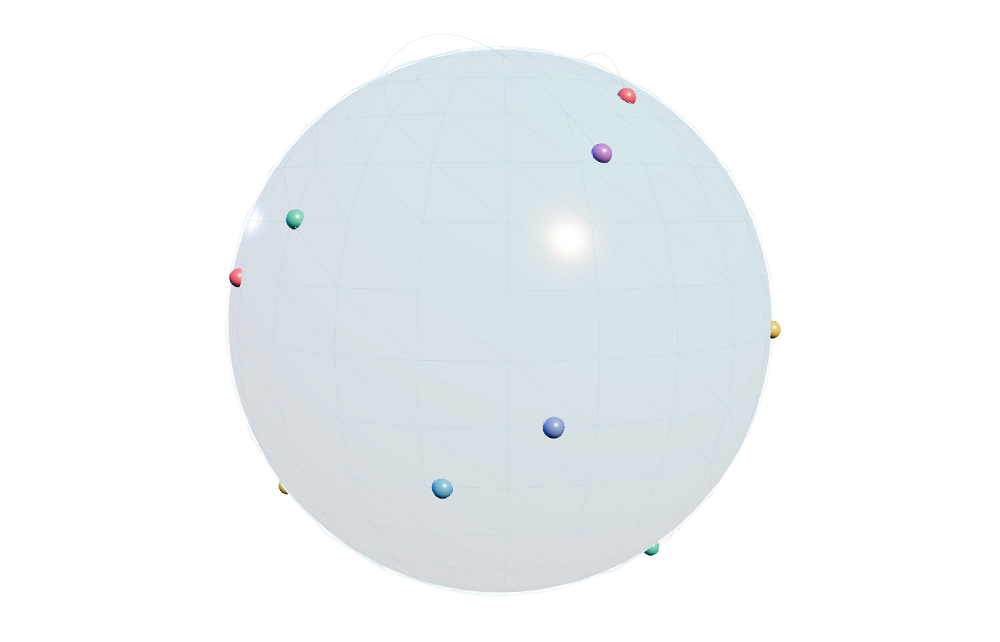 | 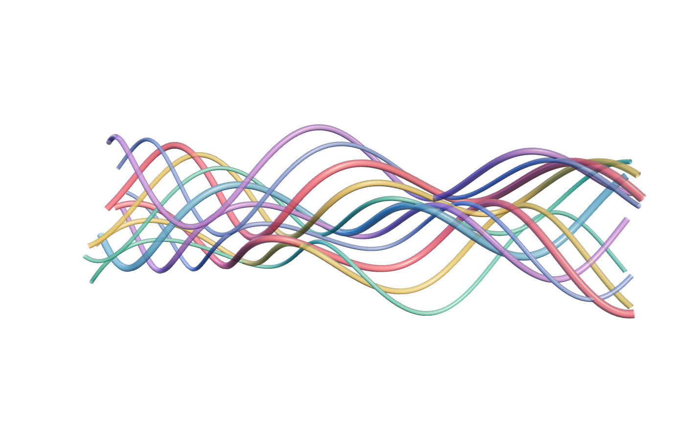 | 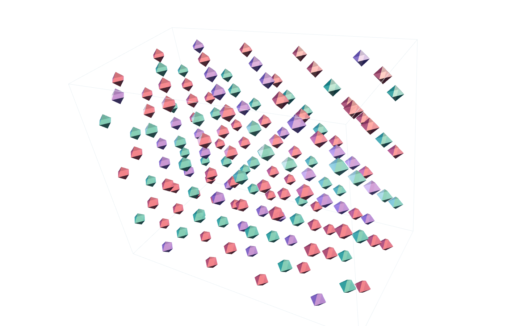 |
| Vectors | Knots | Particles | Metaballs |
| 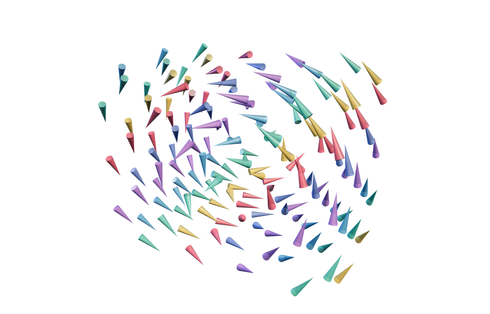 | 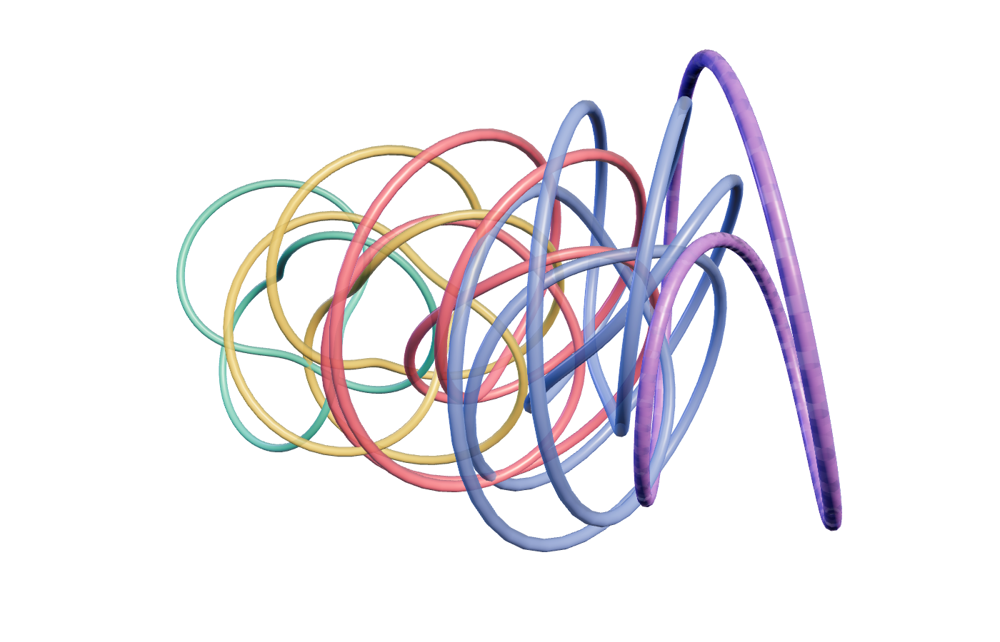 | 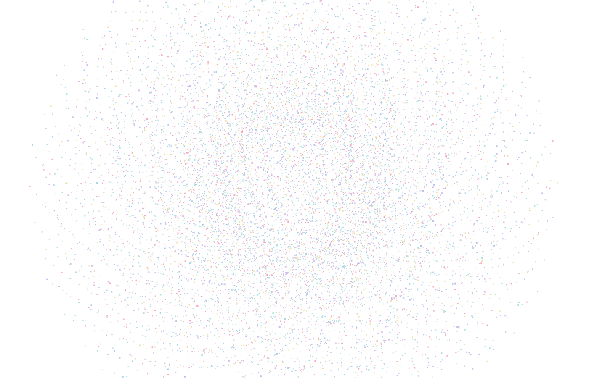 | 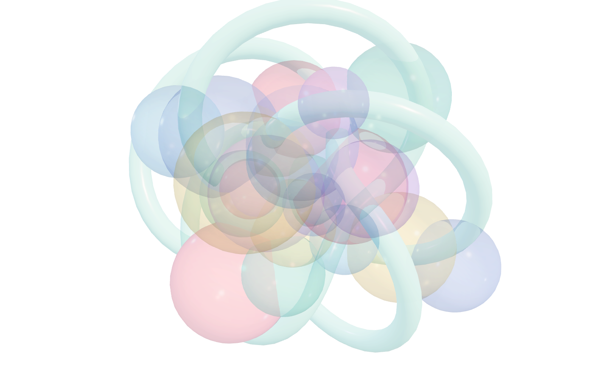 |

Run `npm install && npm test`. Chrome uses SwiftShader when needed, blocks outside networking, checks interaction, captures the transparent canvas, and validates alpha/content thresholds.
